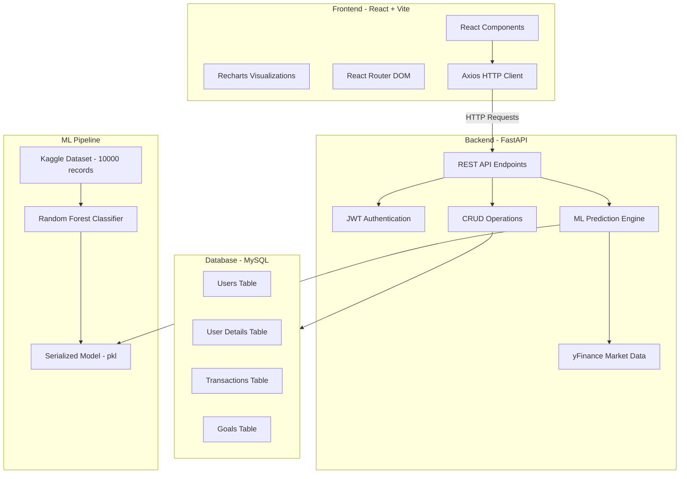
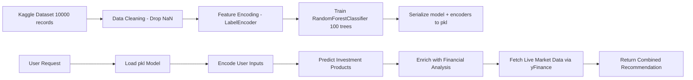
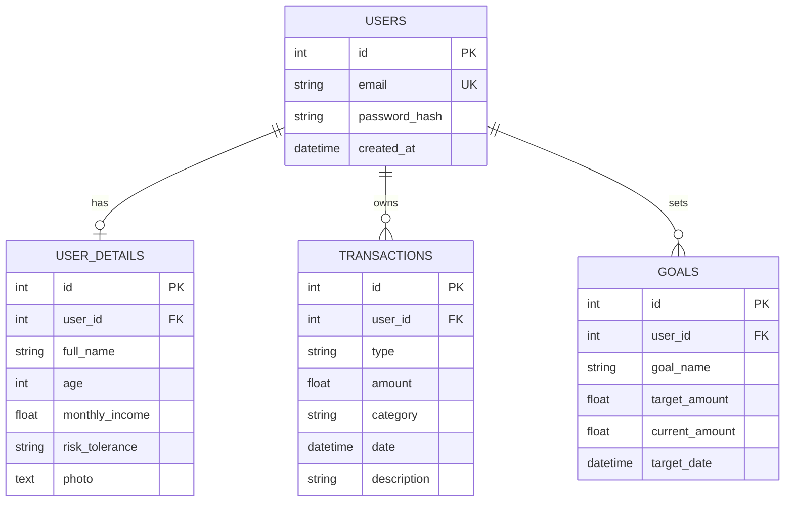

# Nexus — AI-Powered Personal Finance Advisor

> A full-stack, intelligent personal finance management platform that helps users track income, expenses, and savings, set financial goals, and receive AI-driven investment recommendations powered by Machine Learning and live market data.

---

## Table of Contents

1. [Project Overview](#project-overview)
2. [Architecture Diagram](#architecture-diagram)
3. [Technology Stack](#technology-stack)
4. [Backend Deep Dive](#backend-deep-dive)
5. [Frontend Deep Dive](#frontend-deep-dive)
6. [Machine Learning Pipeline](#machine-learning-pipeline)
7. [Database Schema](#database-schema)
8. [API Endpoints](#api-endpoints)
9. [Project File Structure](#project-file-structure)
10. [How to Run](#how-to-run)

---

## Project Overview

**Nexus** is a personal finance advisor that combines traditional financial tracking with AI-powered investment recommendations. Users can:

- **Register & Login** securely with JWT-based authentication
- **Track Transactions** — log income, expenses, and savings with categories
- **Set Savings Goals** — define financial targets with deadlines and track progress visually
- **Get AI Investment Insights** — receive personalized investment recommendations based on their age, income, expenses, savings, risk tolerance, and goals
- **View Analytics** — visualize financial health through interactive charts (line charts, radial bar charts)
- **Edit Profile** — update name, age, risk tolerance, and upload a profile photo

---

## Architecture Diagram



---

## Technology Stack

### Backend

| Technology | Version | Purpose | Why This Choice |
|---|---|---|---|
| **Python** | 3.x | Core backend language | Industry standard for ML/AI applications; rich ecosystem of data science libraries |
| **FastAPI** | Latest | Web framework and REST API | Fastest Python web framework with automatic OpenAPI docs, async support, and built-in request validation via Pydantic |
| **Uvicorn** | Latest | ASGI server | High-performance async server perfectly paired with FastAPI; supports hot-reload for development |
| **SQLAlchemy** | Latest | ORM - Object Relational Mapper | Most mature Python ORM; provides database-agnostic query building, relationship management, and migration support |
| **MySQL** | 8.x | Relational database | Production-grade RDBMS with excellent performance for structured financial data; ACID-compliant for transaction safety |
| **PyMySQL** | Latest | MySQL driver | Pure-Python MySQL client; no C dependencies, easy cross-platform installation |
| **Pydantic** | v2 | Data validation and schemas | Integrated with FastAPI for automatic request/response validation; provides type safety for API contracts |
| **python-jose** | Latest | JWT token handling | Industry-standard JWT implementation for Python; handles token creation, signing, and verification |
| **passlib + bcrypt** | Latest | Password hashing | bcrypt is the gold standard for password hashing - slow by design to resist brute-force attacks |
| **scikit-learn** | Latest | Machine Learning | The go-to ML library for classical algorithms; provides RandomForestClassifier, LabelEncoder, and model serialization |
| **pandas** | Latest | Data manipulation | Essential for loading, cleaning, and transforming the investment dataset before training |
| **yfinance** | Latest | Live market data API | Free Yahoo Finance API wrapper; provides real-time stock prices, indices, and historical data without API keys |
| **pickle** | Built-in | Model serialization | Pythons built-in serialization for saving/loading the trained ML model and label encoders |

### Frontend

| Technology | Version | Purpose | Why This Choice |
|---|---|---|---|
| **React** | 19.x | UI framework | Component-based architecture for building complex, interactive UIs; virtual DOM for performance |
| **Vite** | 8.x | Build tool and dev server | Blazing-fast HMR Hot Module Replacement; instant startup; modern ES module-based development |
| **React Router DOM** | 7.x | Client-side routing | Declarative routing for single-page applications; supports nested routes and navigation guards |
| **Axios** | 1.x | HTTP client | Promise-based HTTP client with interceptors for attaching JWT tokens automatically; clean error handling |
| **Recharts** | 3.x | Data visualization | React-native charting library built on D3.js; provides LineChart, BarChart, RadialBarChart with responsive containers |
| **Lucide React** | 1.x | Icon library | Modern, consistent SVG icon set; tree-shakable - only imports used icons; clean, minimalist design |
| **Vanilla CSS** | - | Styling | Maximum control over the UI; no framework overhead; custom glassmorphism and animation effects |

### Infrastructure

| Technology | Purpose | Why This Choice |
|---|---|---|
| **CORS Middleware** | Cross-origin resource sharing | Allows the frontend port 5173 to communicate with the backend port 8000 during development |
| **OAuth2 Password Bearer** | Token-based auth flow | FastAPIs built-in security scheme; standardized token exchange pattern for SPAs |

---

## Backend Deep Dive

### File-by-File Breakdown

#### `main.py` - Application Entry Point
The central FastAPI application file that registers all routes and middleware.
- Initializes the FastAPI app with CORS middleware
- Creates database tables on startup via SQLAlchemy
- Defines all REST API endpoints for Auth, Users, Transactions, Goals, and Recommendations
- The `/recommendations/` endpoint orchestrates the full ML pipeline: fetches user profile + transaction history then calls ML prediction then fetches live market data then returns combined response

#### `auth.py` - Authentication Module
Handles all security concerns:
- **Password Hashing**: Uses bcrypt via passlib to hash passwords before storage
- **JWT Tokens**: Creates signed tokens with 7-day expiry using python-jose
- **Token Verification**: `get_current_user()` dependency extracts and validates JWT from the Authorization header on every protected endpoint

#### `models.py` - SQLAlchemy ORM Models
Defines the database schema as Python classes:
- **User**: Core identity (email, password hash, timestamps)
- **UserDetail**: Extended profile (name, age, income, risk tolerance, photo as base64)
- **Transaction**: Financial records (type: income/expense/savings, amount, category, date)
- **Goal**: Savings targets (name, target amount, current amount, deadline)

#### `schemas.py` - Pydantic Validation Schemas
Request/response contracts that FastAPI uses for automatic validation:
- Validates email format using `EmailStr`
- Enforces transaction types via `TransactionTypeEnum` (income, expense, savings)
- Separates Create vs Response schemas (e.g., `UserCreate` includes password, `UserResponse` does not)

#### `crud.py` - Database Operations
Clean separation of database logic from API logic:
- CRUD operations for Users, UserDetails, Transactions, and Goals
- Auto-creates a `UserDetail` record when a new user registers
- Supports filtering by `user_id` to ensure data isolation between users

#### `database.py` - Database Configuration
SQLAlchemy engine and session factory:
- Connects to MySQL via `mysql+pymysql` driver
- Session management with proper cleanup via dependency injection

#### `ml.py` - Machine Learning Engine
The brain of the AI recommendations:
- **Model Loading**: Deserializes the trained RandomForest model and label encoders from `investment_model.pkl`
- **Prediction**: Encodes user inputs (age, goal, risk tolerance) and runs the classifier
- **Financial Analysis**: Calculates expense-to-income ratio, savings rate, and generates personalized narrative advice
- **Instrument Descriptions**: Rich descriptions for 10 investment types (Mutual Funds, PPF, NPS, Stocks, Real Estate, REITs, etc.) with risk-specific reasoning
- **Live Market Data**: Fetches real-time prices from Yahoo Finance using `yfinance` for the recommended instruments

#### `train_model.py` - Model Training Script
Offline training pipeline:
- Loads the Kaggle investment recommendations dataset (10,000 records)
- Encodes categorical features (Goals, Gender, Risk Tolerance) with `LabelEncoder`
- Trains a `RandomForestClassifier` with 100 estimators
- Serializes the model + encoders to `investment_model.pkl`

---

## Frontend Deep Dive

### Component Architecture

#### `App.jsx` - Root Component and Layout
- **Authentication Gate**: Checks for JWT token in `localStorage`; shows Auth or Layout accordingly
- **Sidebar Navigation**: Persistent left sidebar with links to Dashboard, Transactions, Saving Goals, AI Insights
- **Dynamic Header**: Fetches users name and photo from the API; displays time-aware greeting (Good morning/afternoon/evening)
- **401 Interceptor**: Axios interceptor auto-logouts if a 401 response is received

#### `Auth.jsx` - Login / Register / Forgot Password
- Three-mode form: Login, Sign Up, and Forgot Password
- Dark card with orange accent theme
- Branded with Nexus logo matching the inner pages
- Sends credentials as `x-www-form-urlencoded` (OAuth2 standard)

#### `Dashboard.jsx` - Main Dashboard with Profile and Analytics
Merged profile dashboard and analytics into one comprehensive view:
- **Balance Card**: Shows total balance (income - expenses) with percentage indicator
- **Income and Expense Cards**: Monthly totals with trend indicators
- **Statistics Line Chart**: Monthly income vs expense trends over time (green/orange lines)
- **All Expenses Radial Chart**: Top expense categories as a concentric radial bar chart with legend
- **Profile Settings Modal**: Click Settings to edit name, age, and upload a profile photo (stored as base64)

#### `Tracker.jsx` - Transaction Management
- Add transactions with type (Income / Expense / Savings), amount, category, date, and description
- View all transactions in a styled list with color-coded badges
- Delete transactions with confirmation
- Real-time updates on add/delete

#### `Goals.jsx` - Savings Goals with Visualization
- Create goals with name, target amount, and deadline
- Automatic progress calculation using savings-type transactions
- Visual progress bars showing completion percentage
- Duration estimates for reaching each goal
- Delete goals when achieved

#### `Recommendations.jsx` - AI Investment Insights
- Select a target goal from your existing goals
- Click Generate Recommendation to invoke the ML pipeline
- Displays:
  - **AI Financial Analysis Banner**: Personalized narrative based on your financial health
  - **Factors Analyzed Card**: Shows all inputs considered (age, income, expenses, savings, risk)
  - **Live Market Data**: Real-time price and daily change for the top recommended asset
  - **Ranked Investment Assets**: Each with a description, Why this for you explanation, and best-for tag

---

## Machine Learning Pipeline



### Dataset
- **Source**: Kaggle - `investment_recommendations_10000.csv`
- **Size**: 10,000 records, ~1.1MB
- **Features**: Individual Goals, Age, Gender, Risk Tolerance, Financial Literacy
- **Target**: Recommended Investment Products (comma-separated list of instruments)

### Model
- **Algorithm**: Random Forest Classifier (100 estimators)
- **Why Random Forest**: Handles categorical features well, resistant to overfitting, no need for feature scaling, provides built-in feature importance
- **Post-Processing**: Model predictions are enhanced with users actual financial data (expense ratios, savings history, age-based advice)

### Supported Investment Instruments
1. Mutual Funds
2. PPF (Public Provident Fund)
3. NPS (National Pension System)
4. Stocks (Direct Equity)
5. Real Estate
6. REITs (Real Estate Investment Trusts)
7. Home Loans
8. Education Bonds
9. Education Loans
10. National Scholarship Scheme

---

## Database Schema



---

## API Endpoints

| Method | Endpoint | Auth | Description |
|---|---|---|---|
| `POST` | `/auth/register` | No | Create a new user account |
| `POST` | `/auth/login` | No | Login and receive JWT token |
| `POST` | `/auth/forgot-password` | No | Request password reset |
| `GET` | `/users/me` | Yes | Get current user info |
| `GET` | `/users/details` | Yes | Get user profile details |
| `PUT` | `/users/details` | Yes | Update profile (name, age, photo, etc.) |
| `POST` | `/transactions/` | Yes | Create a new transaction |
| `GET` | `/transactions/` | Yes | List all user transactions |
| `DELETE` | `/transactions/{id}` | Yes | Delete a transaction |
| `POST` | `/goals/` | Yes | Create a new savings goal |
| `GET` | `/goals/` | Yes | List all user goals |
| `DELETE` | `/goals/{id}` | Yes | Delete a goal |
| `POST` | `/recommendations/` | Yes | Get AI investment recommendations |

---

## Project File Structure

```
finance_advisor/
|-- backend/
|   |-- data/
|   |   +-- investment_recommendations_10000.csv   # Kaggle dataset (10K records)
|   |-- venv/                                       # Python virtual environment
|   |-- auth.py                                     # JWT auth + password hashing
|   |-- crud.py                                     # Database CRUD operations
|   |-- database.py                                 # SQLAlchemy engine and session config
|   |-- main.py                                     # FastAPI app + all route definitions
|   |-- ml.py                                       # ML prediction + market data + descriptions
|   |-- models.py                                   # SQLAlchemy ORM models
|   |-- schemas.py                                  # Pydantic validation schemas
|   |-- train_model.py                              # ML training script
|   |-- investment_model.pkl                        # Serialized trained model (~20MB)
|   |-- create_db.py                                # Database creation utility
|   |-- drop_db.py                                  # Database reset utility
|   +-- migrate_photo.py                            # Migration: add photo column
|
+-- frontend/
    |-- public/                                     # Static assets
    |-- src/
    |   |-- components/
    |   |   |-- Auth.jsx                            # Login / Register / Forgot Password
    |   |   |-- Dashboard.jsx                       # Main dashboard + analytics + profile
    |   |   |-- Tracker.jsx                         # Transaction management
    |   |   |-- Goals.jsx                           # Savings goals with progress tracking
    |   |   +-- Recommendations.jsx                 # AI investment insights
    |   |-- App.jsx                                 # Root component, routing, sidebar layout
    |   |-- App.css                                 # Component-specific styles
    |   |-- index.css                               # Global design system + theme
    |   +-- main.jsx                                # React entry point
    |-- index.html                                  # HTML shell
    |-- package.json                                # NPM dependencies
    +-- vite.config.js                              # Vite build configuration
```

---

## How to Run

### Prerequisites
- Python 3.10+
- Node.js 18+
- MySQL 8.x running locally
- A MySQL database named `finance_advisor`

### Backend
```bash
cd backend
python -m venv venv
venv\Scripts\activate          # Windows
pip install fastapi uvicorn sqlalchemy pymysql python-jose passlib bcrypt pydantic[email] pandas scikit-learn yfinance
python train_model.py          # Train the ML model (one-time)
uvicorn main:app --reload      # Start on http://localhost:8000
```

### Frontend
```bash
cd frontend
npm install
npm run dev                    # Start on http://localhost:5173
```

### Access
Open **http://localhost:5173** in your browser, register a new account, and start managing your finances!

---

> **Built with Python, React, scikit-learn, and live market data from Yahoo Finance.**
